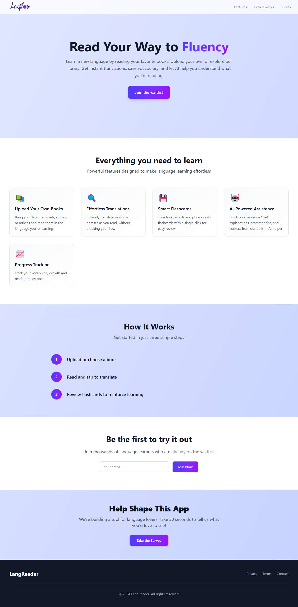

# LexFlow

**LexFlow** is a language learning app designed for passionate readers and language lovers.

LexFlow encourages you to learn languages naturally by reading what you love. Upload your own books, translate with ease, create flashcards and get AI-powered help, all in one beautiful, intuitive platform.

---

## 🌟 Features

- **📚 Upload Your Own Books**  
  Bring your favorite novels, stories, or articles and read them in the language you're learning.

- **🔍 Effortless Translations**  
  Instantly translate words or phrases as you read, without breaking your flow.

- **💾 Smart Flashcards**  
  Turn tricky words and phrases into flashcards with a single click for easy review.

- **🤖 AI-Powered Assistance**  
  Stuck on a sentence? Get explanations, grammar tips, and context from our built-in AI helper.

- **📈 Progress Tracking**  
  Track your vocabulary growth and reading milestones.

- **🌍 Multilingual Support**  
  Learn with content in multiple languages – perfect for polyglots and beginners alike.

---

## 🚀 Get Involved

We're building LexFlow for language lovers, by language lovers.  
**Help Us Build the Perfect Language Learning Tool**

- [Take our quick survey](https://tally.so/r/wMpp2M) and tell us what features matter most to you.
- Star ⭐ this repo to follow our progress.
- [Join our waitlist](https://lexflow-learn.vercel.app/landing) to get notified when we launch!

---

## 📸 Preview

---

## 🛠️ Tech Stack

- **Next.js** & **React**
- **TypeScript** for a robust, scalable codebase
- **Supabase** for secure, real-time database management
- **Tailwind CSS** for beautiful, responsive design
- **Framer Motion** for smooth animations
- **AI integrations** for smart language help
- **Vercel** for fast, reliable hosting
